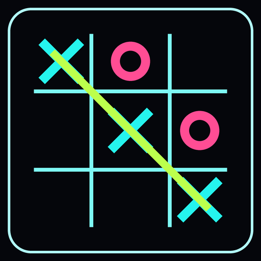

<div align="center">



# GRIDLOCK

**Tic-Tac-Toe, reinvented.**

Play the oldest game in the world against an opponent that cannot be beaten,
or against a friend anywhere in the world, using a five-letter room code.

[](https://gridlock-tic-tac-toe.streamlit.app/)

[](https://www.python.org/)
[](https://streamlit.io/)
[](#is-it-actually-tested)
[](LICENSE)

### [gridlock-tic-tac-toe.streamlit.app](https://gridlock-tic-tac-toe.streamlit.app/)

No download. No sign-up. Open the link and play.

</div>

---

## What is this?

Tic-tac-toe is a game most people stop playing at about age seven, because once
you know the trick, nobody ever wins again.

GRIDLOCK takes that fact seriously and builds a whole game around it. You play
against a computer opponent set to one of four skill levels, the hardest of
which has never lost a game and never will. You can play a friend sitting next
to you, or a friend on the other side of the country. You can make the board
bigger. You can put a clock on it. And every game you play is remembered: your
record, your best winning streak, your badges, and a replay of every match.

It runs in a web browser, on a phone as easily as on a computer. There is
nothing for players to install.

---

## Table of contents

**Playing**
- [Start playing in 10 seconds](#start-playing-in-10-seconds)
- [What can you do in it?](#what-can-you-do-in-it)
- [Playing a friend, anywhere](#playing-a-friend-anywhere)
- [Guest or account?](#guest-or-account)
- [Playing on a phone](#playing-on-a-phone)

**Running your own copy**
- [Run it on your own computer](#run-it-on-your-own-computer)
- [Changing how it looks](#changing-how-it-looks)
- [Putting your copy online](#putting-your-copy-online)
- [Connecting a database](#connecting-a-database)
- [Settings you can change](#settings-you-can-change)

**How it works**
- [What's in each file](#whats-in-each-file)
- [How the computer opponent works](#how-the-computer-opponent-works)
- [How online games work](#how-online-games-work)
- [Is it actually tested?](#is-it-actually-tested)
- [Ideas for later](#ideas-for-later)
- [Licence](#licence)

---

## Start playing in 10 seconds

1. Open **[gridlock-tic-tac-toe.streamlit.app](https://gridlock-tic-tac-toe.streamlit.app/)**
2. Click **Play**
3. Choose a difficulty and take the first square

That is genuinely all of it. You are playing as a guest, which needs no email,
no password and no setup.

Two things to try once you are in:

- Set the difficulty to **Impossible** and try to win. You cannot. Forcing a
  draw is the real victory, and it takes some doing.
- Open **Online**, click **Create room**, and send the five-letter code to a
  friend. They open the same link, type the code, and you are playing each
  other in real time.

> The demo runs on a free host, so if nobody has used it for a while the first
> page load can take twenty or thirty seconds while it wakes up. After that it
> is instant.

---

## What can you do in it?

### Play three different ways

| | |
| --- | --- |
| **Against the computer** | Four skill levels, from a beginner to an opponent that cannot lose. |
| **Against someone next to you** | Two players taking turns on the same screen. |
| **Against someone far away** | Create a room, share the code, play in real time. |

### Pick your opponent's skill

| Level | What it does |
| --- | --- |
| **Easy** | Plays at random. Good for children, or for feeling good about yourself. |
| **Medium** | Takes a win when it sees one and blocks yours. Otherwise careless. |
| **Hard** | Thinks several moves ahead. You have to earn it. |
| **Impossible** | Plays perfectly. The best you can do is force a draw. |

That last claim is not marketing. It is checked automatically every time the
code changes: see [Is it actually tested?](#is-it-actually-tested)

### Change the game itself

- **Board size** - the usual 3×3, or 4×4 and 5×5 where you need four in a row
- **Timed mode** - a countdown on every move; run out and you forfeit the turn
- **Undo** - take a move back when playing the computer
- **Swap sides**, restart, resign, reset the score

### Keep a record

- Games played, won, lost and drawn, plus your win rate and best streak
- Charts of how you have been doing recently
- **Badges** for 12 different achievements
- A **daily challenge** that changes every day
- **Replays**-step through any past game move by move
- Download your entire history as a spreadsheet file

### Make it yours

- Six colour schemes: Neon, Dark, Light, Retro, Minimal and Cyberpunk
- Choose a display name and an avatar
- Turn sounds and animations on or off

---

## Playing a friend, anywhere

1. One of you opens **Online** and clicks **Create room**
2. A five-letter code appears, something like `AB92K`. Send it to your friend
3. They open the same website, go to **Online**, type the code, and click
   **Join room**
4. Play

Whoever created the room goes first as X. The board updates by itself every
couple of seconds, so neither of you needs to refresh anything.

While you play you can send chat messages, tap emoji reactions, ask for a
rematch, or resign. If a third person joins a room that is already full, they
become a **spectator**: they watch the game live and can chat, but cannot move.

**If you lose connection, nothing is lost.** Close the tab, run out of battery,
walk into a lift-rejoin with the same code and the game is exactly where you
left it. Rooms nobody has touched for a while are cleared away automatically.

You can also share a room with a direct link by adding the code to the address:
`gridlock-tic-tac-toe.streamlit.app/?room=AB92K` drops your friend straight in.

---

## Guest or account?

**As a guest**, you can play everything immediately. The catch is that your
history lives in that browser session. Refresh the page and you are a new
player with an empty record.

**With an account**, your record follows you: the same stats on your laptop and
your phone, still there next week. You need an email address and a password of
at least eight characters.

To create one on the live demo: **Settings → Account → Create account**. It
takes about fifteen seconds and there is nothing to confirm or install.

Once signed in, everything you do is filed under that account — every game,
badge and streak — and signing in from any other device brings it all with you.

> **A note on your password.** It is never stored by this app and never passes
> through its code. It goes straight to the authentication service, which keeps
> only a scrambled version that cannot be turned back into your password by
> anyone, including whoever runs the app.

If you are running your own copy of GRIDLOCK, accounts need a database
connected first-see [Connecting a database](#connecting-a-database). Guest
play always works, with or without one.

---

## Playing on a phone

The whole app is built to work at phone width: the board scales, the sidebar
tucks away behind the arrow at the top left, and the buttons are sized for
thumbs.

Two tips:

- **Add it to your home screen** from your browser's share menu, and it opens
  like an app, without the address bar.
- **Sign in** if you want the same record on your phone and your computer.
  Otherwise the two are treated as different players.

If you are playing a friend, both of you can be on phones. Nothing about the
online mode assumes a computer.

---

## Run it on your own computer

Only needed if you want to change the code or run your own copy. To simply play,
use the [live version](https://gridlock-tic-tac-toe.streamlit.app/).

You need **Python** version 3.10 or newer. If you are not sure whether you have
it, open a terminal and type `python3 --version`.

**1. Get the code into a folder** and open a terminal in that folder.

**2. Create a private space for the app's building blocks.** This keeps
GRIDLOCK's requirements separate from everything else on your computer:

```bash
python3 -m venv .venv
```

**3. Switch into that space.** You will do this every time you open a new
terminal:

```bash
source .venv/bin/activate          # Mac and Linux
.venv\Scripts\activate             # Windows
```

You will know it worked when `(.venv)` appears at the start of the line.

**4. Install what it needs.** This downloads a few hundred megabytes and takes
a minute or two:

```bash
pip install -r requirements.txt
```

**5. Start it:**

```bash
python -m streamlit run app.py
```

Your browser opens automatically. If it does not, go to <http://localhost:8501>.
To stop the app, press `Ctrl+C` in the terminal.

> **You do not need to set anything up.** No accounts, no database, no
> configuration. The app quietly keeps your games in a file inside the project
> folder, and everything works from the first run.

---

## Changing how it looks

You do not need to touch any code to change the colours: there is a theme
picker in the sidebar and in Settings.

If you want to go further, everything visual comes from two files:

| To change | Open | Look for |
| --- | --- | --- |
| The colours themselves | `config.py` | `THEMES` — six palettes written as colour codes |
| Lock the app to one colour scheme | `config.py` | `LOCKED_THEME` — set it to a theme name to hide the picker |
| The wording on the home page | `app.py` | `page_home` |
| The app's tagline | `config.py` | `APP_TAGLINE` |
| Spacing, layout, animations | `styles.py` | `base_css` |

Change a colour in `config.py`, restart the app, and it updates everywhere at
once: buttons, board, logo and all. Nothing has colours written into it twice.

---

## Putting your copy online

Two steps, both free: put the code on GitHub, then point a hosting service at
it.

### Step 1-GitHub

Make the folder containing `app.py` the top level of your repository. Before
your first push, check that no private files are included:

```bash
git status --short | grep -E "\.env$|secrets\.toml|data/"
```

That should print **nothing**. The `.gitignore` file already excludes your
private settings, your database and your virtual environment.

### Step 2-Streamlit Community Cloud

1. Go to [share.streamlit.io](https://share.streamlit.io) and sign in with GitHub
2. Click **Create app** and choose your repository, the `main` branch, and
   `app.py`
3. Under **Advanced settings**, choose Python 3.12 and paste your database
   settings into the **Secrets** box, in this format:

   ```toml
   SUPABASE_URL = "https://your-project.supabase.co"
   SUPABASE_KEY = "your-publishable-key"
   ```

4. Click **Deploy** and wait a few minutes

You get a public web address you can share with anyone.

**Other options** are included if you prefer them: `render.yaml` for
[Render](https://render.com), and a `Dockerfile` for anywhere that runs
containers. Both work as they are.

---

## Connecting a database

**You can skip this entirely** if you are only playing on your own computer.

Connect one when you want two things: players on different devices playing each
other, and records that survive permanently. [Supabase](https://supabase.com)
has a free tier that is more than enough.

1. **Create a project** at supabase.com. Save the database password it gives
   you somewhere safe.

2. **Set up the tables.** In the left sidebar, click **SQL Editor** → **New
   snippet**. Open each of these files from the `supabase/migrations` folder,
   copy the contents, paste, and click **Run**, in this order:

   ```
   0001_init.sql                       creates the tables
   0002_realtime_and_maintenance.sql   adds live updates and cleanup
   0003_data_api_grants.sql            gives the app permission to use them
   ```

   Each should report success. Click **Table Editor** afterwards and you should
   see eight tables.

3. **Copy two values across.** In Supabase, open **Project Settings → Data API**
   for your project URL, and **Project Settings → API Keys** for your
   *publishable* key. Then create a file called `.env` in the project folder:

   ```
   SUPABASE_URL=https://your-project.supabase.co
   SUPABASE_KEY=sb_publishable_your_key_here
   ```

4. **Restart the app.** Go to **Settings → Diagnostics**: it should now say
   `supabase` rather than `sqlite`.

> **Use the publishable key, never the secret one.** The publishable key is
> designed to be visible; the secret key bypasses every protection on your
> database and belongs nowhere near your code, your repository, or a chat
> window.

> **A note on privacy.** The database is deliberately open to anonymous
> players, because that is what lets people play without signing up. Game
> results, display names and chat messages are readable by the app's key. Email
> addresses and passwords are not: those are held separately by the
> authentication service. This is a reasonable trade for a game; it would not be
> for anything sensitive.

---

## Settings you can change

All optional. Put them in a file named `.env` in the project folder, or paste
them into your hosting service's secrets box.

| Setting | Default | What it does |
| --- | --- | --- |
| `SUPABASE_URL` | *none* | Your database address. Enables accounts and cross-device play. |
| `SUPABASE_KEY` | *none* | Your publishable key. |
| `ENABLE_GOOGLE_AUTH` | `false` | Adds a "Sign in with Google" button. |
| `OAUTH_REDIRECT_URL` | `http://localhost:8501` | Where sign-in returns you to. |
| `TTT_DATA_DIR` | `./data` | Where the local database file is kept. |
| `LOG_LEVEL` | `INFO` | How much detail appears in the terminal. |
| `FORCE_LOCAL_BACKEND` | `false` | Ignore the database and use the local file. |

---

## What's in each file

```
gridlock/
├── app.py            Everything you see: pages, buttons, layout
├── game.py           The rules of a game: turns, winning, scoring
├── board.py          The board itself: where the marks are, who has won
├── player.py         Who is playing, and which mark they use
├── ai.py             The computer opponent's brain
├── multiplayer.py    Online rooms: joining, taking turns, chat
├── database.py       Saving and loading, whichever storage is in use
├── auth.py           Accounts and guest identities
├── config.py         Colours, settings, everything adjustable
├── styles.py         The visual design
├── utils.py          Sounds, confetti, badges, exports
│
├── assets/           Logo, sound effects, icons: all generated from code
├── supabase/         Database setup files
├── tests/            Automated checks
├── scripts/          Tool to rebuild the assets
│
├── requirements.txt  The list of what to install
├── .env.example      Template for your private settings
└── README.md         This file
```

The design deliberately keeps the *game* separate from the *website*. `board.py`,
`game.py`, `ai.py` and `player.py` know nothing about web pages, so they could be
lifted out and used in a phone app or a chat bot unchanged. Only `app.py`,
`styles.py` and parts of `utils.py` deal with the browser.

---

## How the computer opponent works

The hardest setting uses a technique called **minimax**. In plain terms: the
computer imagines every possible move, then every reply you could make, then
every reply to that, all the way to the end of the game. It then picks the move
that leads to the best guaranteed outcome no matter what you do.

Tic-tac-toe is small enough that this can be done completely, which is why the
result is a computer that genuinely cannot be beaten. The larger boards are too
big to search exhaustively, so it searches as deep as it can within about a
second and a half, using several standard techniques to get further in the same
time.

Two bugs found during development are worth recording, since both are easy to
make and hard to notice:

**Remembering the wrong thing.** The engine saves positions it has already
examined so it does not redo the work. But a score calculated while ignoring
branches is an *estimate*, not a fact, and saving estimates as facts made the
engine confidently wrong. It would occasionally answer a particular opening with
a move that loses. Saved results now record how reliable they are.

**Ties that were not ties.** When several moves are equally good the engine picks
one at random, for variety. But a shortcut in the search caused some losing moves
to *report* the same score as the best move, so "pick one at random" occasionally
picked a loss. Moves at the top level are now evaluated fully, with no shortcut.

---

## How online games work

Each room is one row in a table: the board, whose turn it is, both players, and
when each was last seen.

Your browser is only a display. Every move is sent to the database, checked
there, and sent back, so it does not matter what someone does to the page in
front of them. The rules are enforced where they cannot be edited:

- You must be in the room
- It must be your turn
- The square must be empty
- The game must still be running

Two players clicking at the same instant cannot both succeed. Each move says
"apply this only if the game is still on move seven"; the slower one fails and
that player's board simply refreshes.

The board updates by polling, asking the database for changes every two seconds.
Network connections drop occasionally, especially on phones, so failed requests
are retried automatically and a brief disconnection shows a quiet "Reconnecting…"
message instead of an error.

---

## Is it actually tested?

Yes: 77 automated checks, run with `pytest`.

| What is checked | How |
| --- | --- |
| The board | Winning lines on all three sizes, invalid moves, saving and loading |
| The opponent | Each skill level behaves as described |
| **"Impossible never loses"** | Every possible game is played out, as both first and second player. Zero losses allowed. |
| A game | Turn order, undo, resign, draws, scoring, streaks, replays |
| Online rooms | Turn enforcement, spectators, rematches, reconnecting, chat, cleanup |
| The website itself | Every page loads, moves register, **and two separate sessions play a full online match against each other** |

The last one matters most. Those tests run the actual application the way a
browser would, so a broken button fails the test rather than surprising someone
later.

Run them yourself:

```bash
pip install -r requirements-dev.txt
pytest
```

---

## Ideas for later

- **Instant updates** instead of checking every two seconds
- **Rankings**-a skill rating per player, and matchmaking
- **Tournaments** with brackets and a spectator lobby
- **Merging guest history** into an account when you sign up
- **Keyboard and screen-reader support** for the board
- **Other languages**

---

## Licence

MIT: do what you like with it, including commercially. See [LICENSE](LICENSE).
